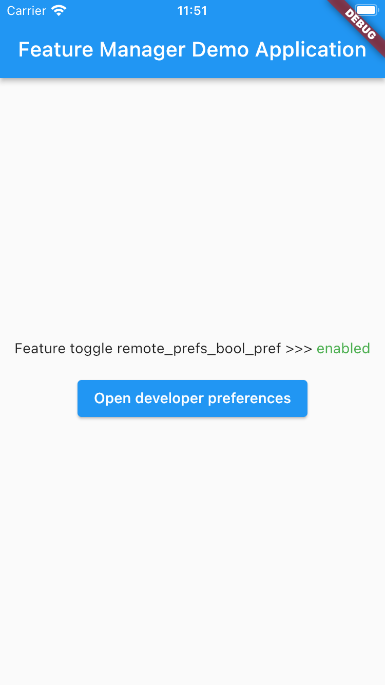
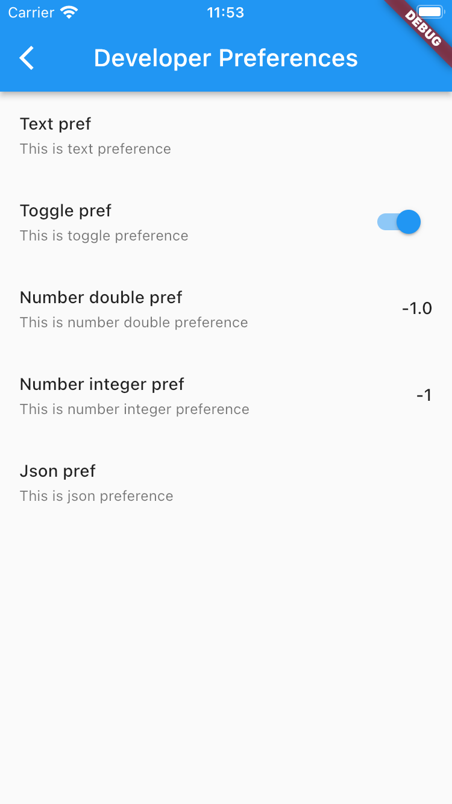
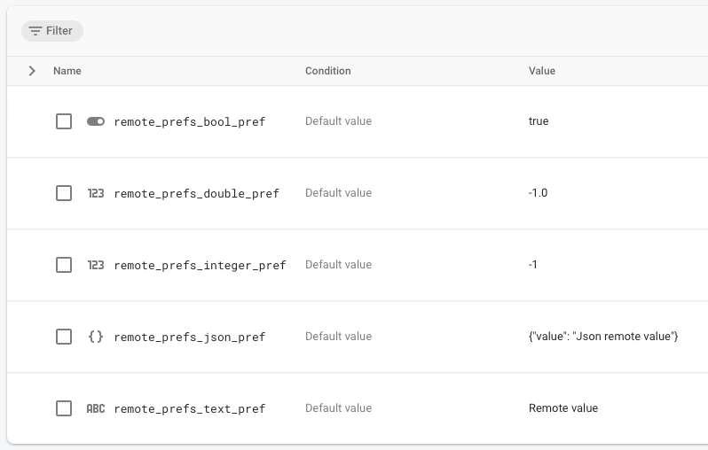

# Remote Config Feature Manager for Flutter

[]

Feature manager allows you to hide some unfinished/secret feature from your users, or experiments, that can be managed
from remote data source or local settings.

If you need only local feature toggles or preferences use [Feature Manager](https://pub.dev/packages/feature_manager)

 

## Getting Started

- [Installation](#installation)
- [Basic Usage](#basic-usage)
- If you want to use A/B testing or feature toggling with Firebase Remote Config use [Remote Config Feature Manager](https://google.com)

## Installation

Add

```bash
remote_config_feature_manager : ^lastest_version
```

to your `pubspec.yaml`, and run

```bash
flutter packages get
```

in your project's root directory.

### Setup Firebase Remote Config in your project.

To get started with Firebase Remote Config for Flutter, please [see the documentation](https://firebase.flutter.dev/docs/remote-config/overview) available at https://firebase.flutter.dev

## Basic Usage

#### Create feature list

Create file where you will store your feature list and create features inside. Don't forget to specify **remoteSourceKey** from Remote Config.

```dart
import 'package:remote_config_feature_manager/remote_config_feature_manager.dart';

class Features {
  static const Feature textFeature = Feature(
    key: 'dev-prefs-text-pref',
    remoteSourceKey: 'remote_prefs_text_pref',
    title: 'Text pref',
    description: 'This is text preference',
    defaultValue: '',
    valueType: FeatureValueType.text,
  );

  static const Feature booleanFeature = Feature(
    key: 'dev-prefs-bool-pref',
    remoteSourceKey: 'remote_prefs_bool_pref',
    title: 'Toggle pref',
    description: 'This is toggle preference',
    defaultValue: false,
    valueType: FeatureValueType.toggle,
  );

  static const Feature doubleFeature = Feature(
    key: 'dev-prefs-double-pref',
    remoteSourceKey: 'remote_prefs_double_pref',
    title: 'Number double pref',
    description: 'This is number double preference',
    defaultValue: 0.0,
    valueType: FeatureValueType.doubleNumber,
  );

  static const Feature integerFeature = Feature(
    key: 'dev-prefs-integer-pref',
    remoteSourceKey: 'remote_prefs_integer_pref',
    title: 'Number integer pref',
    description: 'This is number integer preference',
    defaultValue: 0,
    valueType: FeatureValueType.integerNumber,
  );

  static const Feature jsonFeature = Feature(
    key: 'dev-prefs-json-pref',
    remoteSourceKey: 'remote_prefs_json_pref',
    title: 'Json pref',
    description: 'This is json preference',
    defaultValue: """{"value": "Json default value"}""",
    valueType: FeatureValueType.json,
  );

  static const List<Feature> values = <Feature>[
    Features.textFeature,
    Features.booleanFeature,
    Features.doubleFeature,
    Features.integerFeature,
    Features.jsonFeature,
  ];
}
```

### Active feature manager
To create RemoteConfigFeatureManger provide SharedPreferences and FirebaseRemoteConfig instances.
```dart
...
final RemoteConfigFeatureManager featureManager = RemoteConfigFeatureManager(
          sharedPreferences: sharedPreferences,
          firebaseRemoteConfig: remoteConfig,
      );
...
```

To fetch and active feature values use **activate** function.
```dart
...
await featureManager.activate(
            Features.values,
            minimumFetchInterval: const Duration(
                  minutes: 5,
            ),
      );
...
```

If you want to initialize FirebaseRemoteConfig elsewhere, you can just use **refresh** function to map remote values to your features.
```dart
...
featureManager.refresh(Features.values);
...
```

Using **RemoteConfigFeatureManager** check whether feature is enabled.
Preferable way to create RemoteConfigFeatureManager instance is to use DI (Provider, GetIt etc.).
```dart
...
final bool isEnabled =
    context.read<RemoteConfigFeatureManager>().isEnabled(Features.booleanFeature);
...
```

#### Modify remote feature values in Firebase Console


#### Modify feature values in DEBUG (develop) mode
To do it, you can simply open DeveloperPreferences screen in any part of your app.
You should pass list of your features as parameter for this screen.

P.S. You should hide this button for production builds.

```dart
Navigator.of(context).push(
  MaterialPageRoute(
    builder: (BuildContext context) =>
      DeveloperPreferencesScreen(Features.values),
    ),
);
```

### Feature parameters


| Parameter                 |                       Default                       | Description                                                                                  |
| :------------------------ | :-------------------------------------------------: |:---------------------------------------------------------------------------------------------|
| **key** *String*          |                        required                     | This key will be used to store value in local storage.                                       |
| **type** *FeatureType*    |                         `FeatureType.feature`       | It can be used to separate local features and experiments driven by some remote provider.    |
| **valueType** *FeatureValueType*|                         required              | Type of value of the feature. If you need toggle, use `FeatureValueType.toggle`              |
| **title** *String*        |                          required                   | Title that will be used inside Developer Preferences Screen.                                 |
| **remoteSourceKey** *String*|                                                   | Key from remote source.                                                                      |
| **description** *String*  |                                                     | Description that will be used inside Developer Preferences Screen.                           |
| **value**  *Object?*      |                          Null                       | Stored value of the Feature. Will be fetched from local storage.                             |
| **defaultValue** *Object?*|                   Null                              | Default value of the Feature. Will be returned by `FeatureManager` if stored value is `Null` |

```dart
enum FeatureType { feature, experiment }
```
```dart
enum FeatureValueType { text, toggle, doubleNumber, integerNumber, json }
```

## Contributions
Feel free to contact me (a.e.getman@gmail.com) or create Pull Requests/Issues for this repository :)